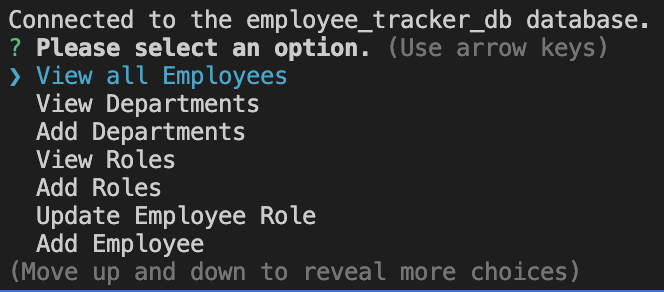
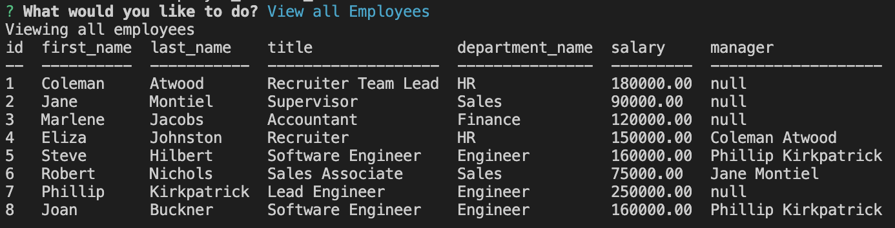

# My Employee Tracker


## Links

Repo:

[Employee Tracker](https://github.com/jonnyboy808/my-employee-tracker)

## Table of Contents

* [Description](#description)
* [Installation](#installation)
* [Code Example](#code-example)
* [Application Examples](#application-examples)
* [Usage](#usage)
* [License](#license)
* [Questions](#questions)


## Description
This is a command line application that allows for easy tracking of your employees. You can choose the application to display all employees within the company as well as only showing either the role, or department. Additionally this quick and easy to use command line application also allows for easy updating of employees and their respected departments. Should more employees become hired, the application also allows for an easy method to add them to the tracker

## Installation
This a command line application and would require forking to use. Simply fork the application to your local machine and start using with your CLI.

## Code Example
Below is an example of code that allows for all departments to be populated withing a table, similar code is used to show roles
```JS
const viewDepartments = () => {
  const query = `SELECT department_name FROM employee_department`;
  connection.query(query, (err, res) => {
    if (err) throw err;
    console.log('Viewing all Departments');
    console.table(res);
    valueUpdate();
  });
};
```
This is an additional example showing how the seeds.sql file allows for the joining of information to display in a table
```sql
SELECT employee.id, employee.first_name, employee.last_name, employee_role.title, employee_department.department_name, employee_role.salary, CONCAT(manager.first_name, manager.last_name) AS manager
FROM employee 
LEFT JOIN employee manager ON manager.id = employee.manager_id
INNER JOIN employee_role ON employee.role_id = employee_role.id
INNER JOIN employee_department ON employee_department.id = employee_role.department_id;

```


## Application Examples
Bellow are a couple examples of the application when in use

The first example shows the list that it prompted when the application is first ran.


---

The second screenshot is an example of a table displaying all employees and information.



## Usage
Make sure you have followed the instructions within the [Installation](#installation) section of the README to start using the application, if not already done so. After starting the application within your command line interface, you can start adding, updating, and viewing all employees by using mysql. To get started run the schema and seed sql to build the database. After the build run server.js to initialize the prompts. From here you can use the options to update your own employee list. When done, simply navigate to the 'Exit Application' option and the employee tracker application will close out.


## License


For additional information on this license please use the provided link

[MIT License](https://choosealicense.com/licenses/mit/)

## Questions
Please refer any questions to my Github

Github: [jonnyboy808](https://github.com/jonnyboy808)


